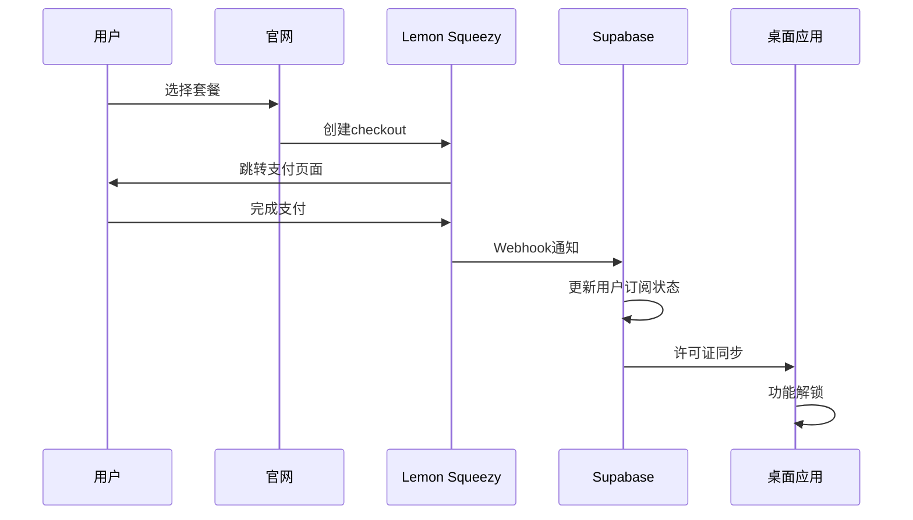

# StreamVault Pro 商业化系统架构

## 🏗️ 整体架构设计

### 系统组成部分

```
┌─────────────────────────────────────────────────────────────┐
│                    StreamVault Pro 商业化生态               │
├─────────────────────────────────────────────────────────────┤
│  🌐 官方网站 (streamvault.pro)                             │
│  ├── 产品展示                                             │
│  ├── 价格方案                                             │
│  ├── 用户注册/登录                                        │
│  └── 下载中心                                             │
├─────────────────────────────────────────────────────────────┤
│  💰 支付系统 (Lemon Squeezy)                              │
│  ├── 订阅管理                                             │
│  ├── 支付处理                                             │
│  ├── 发票生成                                             │
│  └── Webhook通知                                          │
├─────────────────────────────────────────────────────────────┤
│  👤 用户系统 (Supabase)                                   │
│  ├── 用户认证                                             │
│  ├── 用户资料                                             │
│  ├── 订阅状态                                             │
│  └── 许可证管理                                           │
├─────────────────────────────────────────────────────────────┤
│  🔐 许可证系统 (Desktop App)                              │
│  ├── 许可证验证                                           │
│  ├── 功能解锁                                             │
│  ├── 机器绑定                                             │
│  └── 在线验证                                             │
├─────────────────────────────────────────────────────────────┤
│  📊 管理后台                                               │
│  ├── 用户管理                                             │
│  ├── 订阅管理                                             │
│  ├── 财务报表                                             │
│  └── 系统监控                                             │
└─────────────────────────────────────────────────────────────┘
```

## 💰 支付集成方案 (Lemon Squeezy)

### 为什么选择 Lemon Squeezy

- ✅ 专为SaaS设计的支付平台
- ✅ 自动处理税务和合规
- ✅ 支持订阅和一次性购买
- ✅ 强大的Webhook系统
- ✅ 全球支付支持

### 支付流程设计



### Lemon Squeezy 配置

```javascript
// 产品配置示例
const products = {
  trial: {
    id: "trial_product_id",
    name: "试用版",
    price: 0,
    duration: "15_days",
    features: ["5个直播间", "基础录制", "邮件支持"]
  },
  professional: {
    id: "pro_product_id", 
    name: "专业版",
    price: 299,
    duration: "monthly",
    features: ["50个直播间", "AI分析", "优先支持"]
  },
  enterprise: {
    id: "ent_product_id",
    name: "企业版", 
    price: 999,
    duration: "monthly",
    features: ["无限直播间", "团队协作", "7x24支持"]
  }
};
```

## 👤 用户管理方案 (Supabase)

### 数据库设计

```sql
-- 用户表
CREATE TABLE users (
  id UUID PRIMARY KEY DEFAULT gen_random_uuid(),
  email VARCHAR UNIQUE NOT NULL,
  password_hash VARCHAR NOT NULL,
  full_name VARCHAR,
  company VARCHAR,
  phone VARCHAR,
  created_at TIMESTAMP DEFAULT NOW(),
  updated_at TIMESTAMP DEFAULT NOW()
);

-- 订阅表
CREATE TABLE subscriptions (
  id UUID PRIMARY KEY DEFAULT gen_random_uuid(),
  user_id UUID REFERENCES users(id),
  product_id VARCHAR NOT NULL,
  status VARCHAR NOT NULL, -- active, cancelled, expired
  starts_at TIMESTAMP NOT NULL,
  ends_at TIMESTAMP,
  lemon_squeezy_id VARCHAR UNIQUE,
  created_at TIMESTAMP DEFAULT NOW(),
  updated_at TIMESTAMP DEFAULT NOW()
);

-- 许可证表
CREATE TABLE licenses (
  id UUID PRIMARY KEY DEFAULT gen_random_uuid(),
  user_id UUID REFERENCES users(id),
  subscription_id UUID REFERENCES subscriptions(id),
  license_key VARCHAR UNIQUE NOT NULL,
  machine_id VARCHAR,
  status VARCHAR NOT NULL, -- active, suspended, revoked
  last_validated TIMESTAMP,
  created_at TIMESTAMP DEFAULT NOW(),
  updated_at TIMESTAMP DEFAULT NOW()
);

-- 使用统计表
CREATE TABLE usage_stats (
  id UUID PRIMARY KEY DEFAULT gen_random_uuid(),
  license_id UUID REFERENCES licenses(id),
  feature VARCHAR NOT NULL,
  usage_count INTEGER DEFAULT 0,
  date DATE NOT NULL,
  created_at TIMESTAMP DEFAULT NOW()
);
```

### Supabase Functions

```javascript
// 创建用户订阅
async function createSubscription(userId, productId, lemonSqueezyData) {
  const { data, error } = await supabase
    .from('subscriptions')
    .insert({
      user_id: userId,
      product_id: productId,
      status: 'active',
      starts_at: lemonSqueezyData.starts_at,
      ends_at: lemonSqueezyData.ends_at,
      lemon_squeezy_id: lemonSqueezyData.id
    });
    
  if (!error) {
    await generateLicense(userId, data[0].id);
  }
  
  return { data, error };
}

// 生成许可证
async function generateLicense(userId, subscriptionId) {
  const licenseKey = generateSecureLicenseKey();
  
  const { data, error } = await supabase
    .from('licenses')
    .insert({
      user_id: userId,
      subscription_id: subscriptionId,
      license_key: licenseKey,
      status: 'active'
    });
    
  return { data, error };
}
```

## 🔐 许可证系统设计

### 许可证验证流程

```python
# app/core/license_manager.py 增强版

import hashlib
import hmac
import requests
import json
from datetime import datetime, timedelta
from cryptography.fernet import Fernet

class EnhancedLicenseManager:
    def __init__(self):
        self.api_base = "https://api.streamvault.pro"
        self.encryption_key = self._get_encryption_key()
        
    def validate_license_online(self, license_key: str, machine_id: str) -> dict:
        """在线验证许可证"""
        try:
            payload = {
                "license_key": license_key,
                "machine_id": machine_id,
                "app_version": self.get_app_version(),
                "timestamp": datetime.now().isoformat()
            }
            
            response = requests.post(
                f"{self.api_base}/license/validate",
                json=payload,
                timeout=10
            )
            
            if response.status_code == 200:
                result = response.json()
                self._cache_validation_result(result)
                return result
            else:
                return self._get_cached_validation()
                
        except Exception as e:
            print(f"在线验证失败: {e}")
            return self._get_cached_validation()
    
    def check_subscription_status(self, license_key: str) -> dict:
        """检查订阅状态"""
        try:
            response = requests.get(
                f"{self.api_base}/subscription/status/{license_key}",
                timeout=5
            )
            
            if response.status_code == 200:
                return response.json()
            else:
                return {"status": "unknown", "expires_at": None}
                
        except Exception:
            return {"status": "offline", "expires_at": None}
    
    def get_feature_limits(self, license_type: str) -> dict:
        """获取功能限制"""
        limits = {
            "trial": {
                "max_streams": 5,
                "ai_analysis": False,
                "cloud_storage": False,
                "api_access": False,
                "team_features": False
            },
            "professional": {
                "max_streams": 50,
                "ai_analysis": True,
                "cloud_storage": True,
                "api_access": True,
                "team_features": False
            },
            "enterprise": {
                "max_streams": -1,  # 无限制
                "ai_analysis": True,
                "cloud_storage": True,
                "api_access": True,
                "team_features": True
            }
        }
        return limits.get(license_type, limits["trial"])
```

### 机器绑定机制

```python
import uuid
import platform
import hashlib

class MachineBinding:
    @staticmethod
    def get_machine_id() -> str:
        """生成唯一机器ID"""
        machine_info = {
            "platform": platform.platform(),
            "processor": platform.processor(),
            "mac_address": ':'.join([hex(uuid.getnode())[2:][i:i+2] 
                                   for i in range(0, 12, 2)])
        }
        
        machine_string = json.dumps(machine_info, sort_keys=True)
        return hashlib.sha256(machine_string.encode()).hexdigest()[:16]
    
    @staticmethod
    def bind_license_to_machine(license_key: str, machine_id: str) -> bool:
        """绑定许可证到机器"""
        try:
            response = requests.post(
                f"{api_base}/license/bind",
                json={
                    "license_key": license_key,
                    "machine_id": machine_id
                }
            )
            return response.status_code == 200
        except Exception:
            return False
```

## 🌐 官网架构 (Next.js + Supabase)

### 技术栈
- **前端**: Next.js 14 + TypeScript
- **UI库**: Tailwind CSS + Shadcn/ui  
- **后端**: Supabase (PostgreSQL + Auth + Functions)
- **支付**: Lemon Squeezy
- **部署**: Vercel + CDN

### 核心页面结构

```
streamvault.pro/
├── / (首页 - 产品介绍)
├── /pricing (价格方案)
├── /download (下载页面)
├── /login (用户登录)
├── /register (用户注册)
├── /dashboard (用户控制台)
│   ├── /subscription (订阅管理)
│   ├── /licenses (许可证管理)
│   ├── /billing (账单管理)
│   └── /support (技术支持)
├── /docs (文档中心)
├── /api (API文档)
└── /support (支持中心)
```

### 用户注册流程

```typescript
// pages/api/auth/register.ts
export default async function handler(req: NextApiRequest, res: NextApiResponse) {
  if (req.method === 'POST') {
    const { email, password, fullName, company } = req.body;
    
    // 在Supabase中创建用户
    const { user, error } = await supabase.auth.signUp({
      email,
      password,
      options: {
        data: {
          full_name: fullName,
          company: company
        }
      }
    });
    
    if (!error) {
      // 自动创建15天试用
      await createTrialSubscription(user.id);
      
      res.status(200).json({ 
        success: true, 
        message: '注册成功，试用许可证已发送至邮箱' 
      });
    } else {
      res.status(400).json({ error: error.message });
    }
  }
}
```

## 📊 商业智能和分析

### 数据分析指标

```sql
-- 用户增长分析
SELECT 
  DATE_TRUNC('month', created_at) as month,
  COUNT(*) as new_users,
  COUNT(*) FILTER (WHERE created_at >= NOW() - INTERVAL '30 days') as active_users
FROM users 
GROUP BY month 
ORDER BY month;

-- 收入分析
SELECT 
  DATE_TRUNC('month', created_at) as month,
  product_id,
  COUNT(*) as subscriptions,
  SUM(CASE 
    WHEN product_id = 'pro_product_id' THEN 299
    WHEN product_id = 'ent_product_id' THEN 999
    ELSE 0
  END) as revenue
FROM subscriptions 
WHERE status = 'active'
GROUP BY month, product_id 
ORDER BY month;

-- 流失率分析
SELECT 
  DATE_TRUNC('month', updated_at) as month,
  COUNT(*) FILTER (WHERE status = 'cancelled') as cancelled,
  COUNT(*) as total,
  ROUND(
    COUNT(*) FILTER (WHERE status = 'cancelled') * 100.0 / COUNT(*), 2
  ) as churn_rate
FROM subscriptions 
GROUP BY month 
ORDER BY month;
```

## 🔗 系统集成方案

### Webhook处理 (Lemon Squeezy → Supabase)

```javascript
// supabase/functions/lemon-squeezy-webhook/index.ts
import { serve } from "https://deno.land/std@0.168.0/http/server.ts"
import { createClient } from 'https://esm.sh/@supabase/supabase-js@2'

serve(async (req) => {
  if (req.method === 'POST') {
    const payload = await req.json()
    const supabase = createClient(/* config */)
    
    switch (payload.meta.event_name) {
      case 'subscription_created':
        await handleSubscriptionCreated(payload.data, supabase)
        break
        
      case 'subscription_cancelled':
        await handleSubscriptionCancelled(payload.data, supabase)
        break
        
      case 'subscription_expired':
        await handleSubscriptionExpired(payload.data, supabase)
        break
    }
    
    return new Response(JSON.stringify({ received: true }), {
      headers: { 'Content-Type': 'application/json' }
    })
  }
})

async function handleSubscriptionCreated(data, supabase) {
  // 更新用户订阅状态
  await supabase
    .from('subscriptions')
    .update({ 
      status: 'active',
      lemon_squeezy_id: data.id 
    })
    .eq('id', data.attributes.custom_data.subscription_id)
    
  // 生成新的许可证
  await generateLicense(data.attributes.custom_data.user_id)
  
  // 发送欢迎邮件
  await sendWelcomeEmail(data.attributes.user_email)
}
```

### 桌面应用同步机制

```python
# app/core/sync_manager.py
class SyncManager:
    def __init__(self, license_manager):
        self.license_manager = license_manager
        self.sync_interval = 3600  # 1小时同步一次
        
    async def sync_subscription_status(self):
        """同步订阅状态"""
        license_key = self.license_manager.get_current_license()
        if not license_key:
            return
            
        try:
            response = await self.api_client.get(
                f"/subscription/status/{license_key}"
            )
            
            if response.status_code == 200:
                data = response.json()
                await self.update_local_license_cache(data)
                
                # 如果订阅过期，禁用高级功能
                if data['status'] == 'expired':
                    await self.disable_premium_features()
                    
        except Exception as e:
            print(f"同步失败: {e}")
    
    async def update_local_license_cache(self, data):
        """更新本地许可证缓存"""
        cache_data = {
            "status": data["status"],
            "expires_at": data["expires_at"],
            "features": data["features"],
            "last_sync": datetime.now().isoformat()
        }
        
        with open("license_cache.json", "w") as f:
            json.dump(cache_data, f)
```

## 🚀 部署和运维

### 官网部署 (Vercel)

```bash
# 环境变量配置
NEXT_PUBLIC_SUPABASE_URL=your_supabase_url
NEXT_PUBLIC_SUPABASE_ANON_KEY=your_anon_key
SUPABASE_SERVICE_ROLE_KEY=your_service_role_key
LEMON_SQUEEZY_API_KEY=your_ls_api_key
LEMON_SQUEEZY_WEBHOOK_SECRET=your_webhook_secret
```

### 监控和日志

```python
# 应用内监控
class TelemetryManager:
    def track_license_validation(self, license_key: str, success: bool):
        """跟踪许可证验证事件"""
        event = {
            "event": "license_validation",
            "license_key": license_key[:8] + "...",  # 部分脱敏
            "success": success,
            "timestamp": datetime.now().isoformat(),
            "app_version": self.get_app_version()
        }
        
        # 发送到分析服务
        self.send_event(event)
    
    def track_feature_usage(self, feature: str, user_id: str):
        """跟踪功能使用"""
        event = {
            "event": "feature_usage",
            "feature": feature,
            "user_id": user_id,
            "timestamp": datetime.now().isoformat()
        }
        
        self.send_event(event)
```

## 📈 商业指标和KPI

### 核心指标监控

1. **用户指标**
   - 注册用户数
   - 活跃用户数 (DAU/MAU)
   - 用户留存率

2. **收入指标**
   - MRR (月度经常性收入)
   - ARR (年度经常性收入)
   - ARPU (单用户平均收入)

3. **产品指标**
   - 试用转化率
   - 功能使用率
   - 支持请求数量

4. **运营指标**
   - 客户获取成本 (CAC)
   - 客户生命周期价值 (LTV)
   - 流失率

这个架构设计确保了：
- 🔐 安全的许可证管理
- 💰 可靠的支付处理
- 📊 完整的数据分析
- 🚀 可扩展的系统架构
- 💼 专业的商业运营

您觉得这个商业化架构方案如何？需要我详细展开某个部分吗？ 